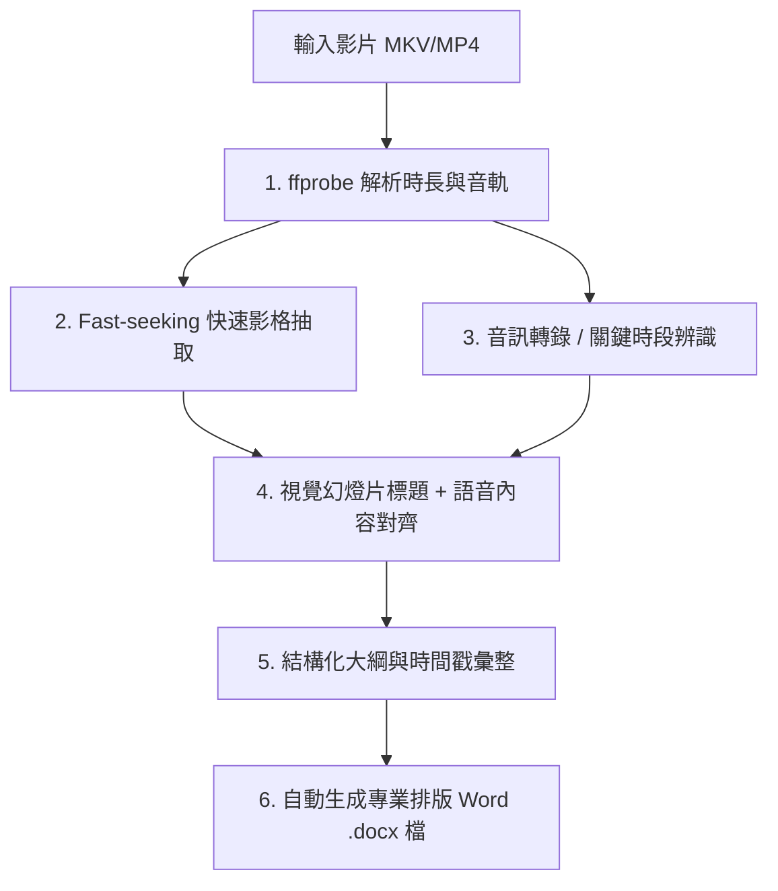

# 影片大綱與時間戳生成技能指南 (Video Outline & Timestamp Generator)

本 Skill 提供了一套完整的自動化工作流，用於處理教學影片、線上講座、會議錄影等長影片（MKV、MP4、MOV 等），自動提取章節結構、精確時間戳、重點摘要，並產出排版精美的 Word (.docx) 文件。

---

## 核心能力與工作流程 (Core Workflow)



---

## 目錄結構

```text
E:\2.6 技能Skills\video-outline-generator\
├── SKILL.md                               # 本技能核心 SOP 與操作規範
├── scripts\
│   ├── extract_video_frames.py            # FFmpeg 高速影格擷取工具（支援自訂間隔）
│   └── generate_docx_outline.py           # 通用專業 Word 大綱生成引擎（深藍商務配色）
└── templates\
    ├── outline_template.md                # 結構化大綱 Markdown 寫作模板
    └── outline_data_schema.json           # Word 生成器所需的 JSON 資料結構範本
```

---

## 標準作業流程 (Step-by-Step SOP)

### 步驟 1：檢測影片時長與元數據
使用 `ffprobe` 快速取得影片時長（秒數）：
```powershell
ffprobe -v error -show_entries format=duration -of default=noprint_wrappers=1:nokey=1 "input_video.mkv"
```

### 步驟 2：執行快速影格抽取 (Fast Seeking)
使用內建工具腳本 [`scripts/extract_video_frames.py`](./scripts/extract_video_frames.py)，以 fast-seeking 方式每 60~90 秒抽取一張影格：
```powershell
python "E:\2.6 技能Skills\video-outline-generator\scripts\extract_video_frames.py" --video "影片路徑.mkv" --interval 60 --output "./frames"
```
* **優點**：採用 `-ss` 快速跳轉，處理 2.5 小時長影片僅需 2~3 分鐘即可產出全片關鍵畫面。

### 步驟 3：分析視覺畫面與語音時間戳
1. 檢視影格中的投影片標題、投影片切換點、程式碼展示畫面。
2. 標註各主要單元（H1/H2）、子主題（H3）的精確起訖時間戳（格式：`HH:MM:SS`）。

### 步驟 4：套用模板產出 Word (.docx) 文件
使用內建 Word 生成引擎 [`scripts/generate_docx_outline.py`](./scripts/generate_docx_outline.py) 將整理好的大綱轉為 Word 文件：
```powershell
python "E:\2.6 技能Skills\video-outline-generator\scripts\generate_docx_outline.py" --input "outline_data.json" --output "課程大綱與時間戳.docx"
```

---

## Word 文件排版規範標準
1. **版面配置**：標準 A4、邊距 0.8 英吋、微軟正黑體。
2. **色彩體系**：
   - 主色調：深海藍（`#182B49`，標題、表頭背景）
   - 副色調：海洋藍（`#2980B9`，次級標題、時間戳高亮）
   - 輔色調：古銅金（`#B8860B`，重點提示）
   - 內文：深炭灰（`#2C3E50`）
3. **必備模組**：
   - 影片元數據摘要表（日期、時長、講師、主題）
   - 章節導覽與精確時間戳總表（包含起訖時間戳、單元名稱、摘要）
   - 各單元詳細剖析（重點項目符號、重點整理 Callout 方框、數據對照表、原始碼區塊）
